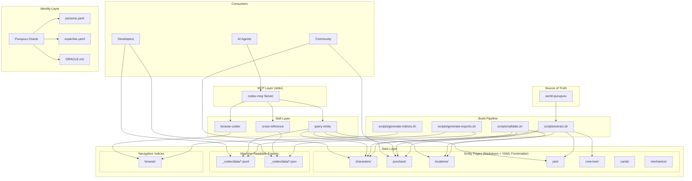
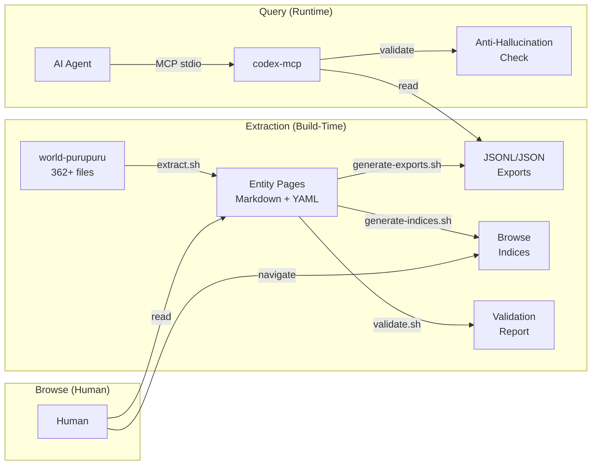
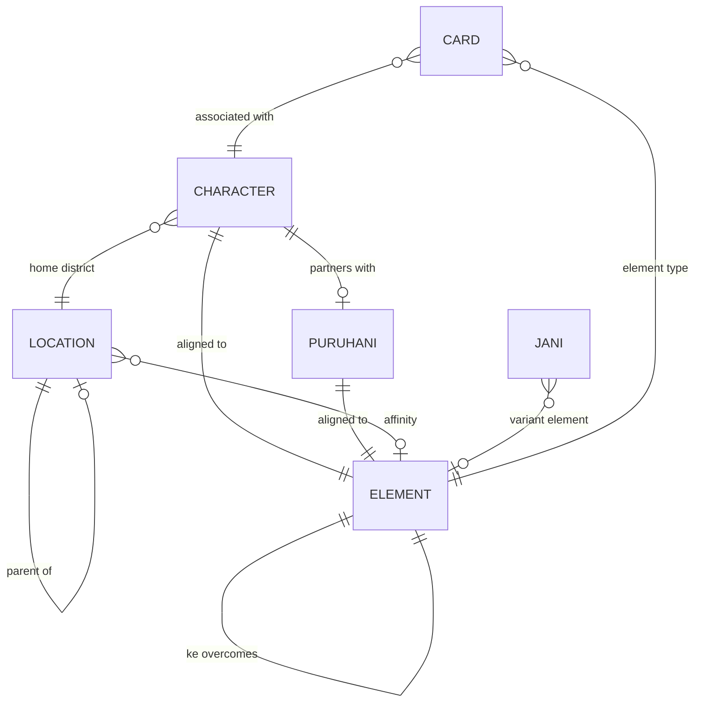

# Software Design Document: construct-purupuru-codex

**Version:** 1.0
**Date:** 2026-05-14
**Author:** Architecture Designer Agent
**Status:** Draft
**PRD Reference:** grimoires/loa/prd.md

---

## Table of Contents

1. [Project Architecture](#1-project-architecture)
2. [Software Stack](#2-software-stack)
3. [Database Design](#3-database-design)
4. [UI Design](#4-ui-design)
5. [API Specifications](#5-api-specifications)
6. [Error Handling Strategy](#6-error-handling-strategy)
7. [Testing Strategy](#7-testing-strategy)
8. [Development Phases](#8-development-phases)
9. [Known Risks and Mitigation](#9-known-risks-and-mitigation)
10. [Open Questions](#10-open-questions)
11. [Appendix](#11-appendix)

---

## 1. Project Architecture

### 1.1 System Overview

construct-purupuru-codex is a **construct-format knowledge base** that serves as the canonical, queryable source of truth for the Purupuru universe. It transforms 362+ files of scattered world-building content from `world-purupuru` into structured, machine-readable, agent-consumable, and human-browsable entity pages with deterministic lookup capabilities.

> From prd.md: "Build construct-purupuru-codex -- a construct-format codex that serves as the canonical, queryable source of truth for the Purupuru universe." (prd.md:L29)

The system is **not** a traditional web application. It is a static knowledge base with:
- Structured markdown entity pages (with YAML frontmatter)
- Pre-computed machine-readable exports (JSONL/JSON)
- A stdio-based MCP server for programmatic access
- Skill definitions for agent-driven browsing, querying, and cross-referencing

### 1.2 Architectural Pattern

**Pattern:** Static Knowledge Base with MCP Server Facade

**Justification:**
The PRD explicitly describes a read-only reference system with pre-computed data. Per prd.md:L219: "Browse indices: pre-computed, not dynamic" and prd.md:L269: "Content generation (codex is read-only reference, not a generator)". A static knowledge base with a thin MCP server layer is the correct fit because:

1. **No runtime state** -- All data is extracted once from `world-purupuru` and served as files
2. **Multiple consumers** -- AI agents (MCP), developers (JSONL/JSON), humans (markdown) all read the same data in different formats
3. **Construct-format compliance** -- Must conform to `construct-base` structure (prd.md:L197)
4. **Anti-hallucination by design** -- Deterministic file-based lookups eliminate runtime data fabrication

This follows the established pattern from `construct-mibera-codex` (prd.md:L29).

### 1.3 Component Diagram



### 1.4 System Components

#### Data Layer -- Entity Pages

- **Purpose:** Store canonical entity data as structured markdown with YAML frontmatter
- **Responsibilities:** Hold the single source of truth for each entity; provide human-readable browsing; serve as input for machine-readable export generation
- **Interfaces:** Filesystem reads (markdown files with YAML frontmatter)
- **Dependencies:** `world-purupuru` source material for initial extraction

#### Data Layer -- Machine-Readable Exports

- **Purpose:** Provide pre-computed JSONL/JSON files for programmatic consumption
- **Responsibilities:** Deterministic entity lookups; bulk data access; knowledge graph representation
- **Interfaces:** File reads (`_codex/data/*.jsonl`, `_codex/data/*.json`)
- **Dependencies:** Entity pages (generated from structured frontmatter)

#### Data Layer -- Navigation Indices

- **Purpose:** Pre-computed browse indices for dimensional navigation
- **Responsibilities:** List entities per dimension value; support cross-dimensional queries
- **Interfaces:** File reads (`browse/*.md`)
- **Dependencies:** Entity pages (generated from frontmatter dimensions)

#### Skill Layer

- **Purpose:** Provide agent-consumable query capabilities
- **Responsibilities:** Browse by dimension, deterministic entity lookup, cross-reference traversal
- **Interfaces:** Skill invocations via construct skill protocol (SKILL.md + index.yaml)
- **Dependencies:** Entity pages, machine-readable exports, browse indices

#### MCP Server (codex-mcp)

- **Purpose:** Expose codex data over Model Context Protocol for AI agent consumption
- **Responsibilities:** Route MCP tool calls to appropriate data; validate queries; return structured responses; reject fabricated entity references
- **Interfaces:** stdio-based MCP protocol (JSON-RPC over stdin/stdout)
- **Dependencies:** Machine-readable exports (`_codex/data/`)

#### Identity Layer (Purupuru Oracle)

- **Purpose:** Define the persona and cognitive frame for AI agents interacting with the codex
- **Responsibilities:** Set voice, expertise scope, behavioral constraints; define the 7-book knowledge system
- **Interfaces:** `construct.yaml` identity configuration, `CLAUDE.md` system prompt
- **Dependencies:** None (static configuration)

#### Build Pipeline

- **Purpose:** Extract, transform, validate, and export codex data from source material
- **Responsibilities:** Parse `world-purupuru` source files; generate entity pages; produce JSONL/JSON exports; build browse indices; validate canon integrity
- **Interfaces:** CLI scripts (`scripts/*.sh` or `scripts/*.ts`)
- **Dependencies:** `world-purupuru` repository content

#### Validation Layer

- **Purpose:** Enforce canon integrity and anti-hallucination guarantees
- **Responsibilities:** Validate entity data against schema; check canon tier consistency; track coverage gaps; reject fabricated entities
- **Interfaces:** CI validation (`validate.yml`), `validate_world_element()` MCP tool
- **Dependencies:** Entity pages, `_codex/data/gaps.json`

### 1.5 Data Flow



Data flows in two distinct modes:

1. **Build-time (extract-transform-load):** `world-purupuru` source files are parsed by extraction scripts, transformed into structured entity pages, then exported as JSONL/JSON and browse indices. Validation runs against the full corpus.

2. **Runtime (read-only):** AI agents query via MCP tools; developers read JSONL/JSON directly; humans browse markdown pages and indices. No runtime writes occur.

### 1.6 External Integrations

| Service | Purpose | API Type | Documentation |
|---------|---------|----------|---------------|
| `world-purupuru` | Source material for entity extraction | Git submodule / filesystem | Local repo |
| `construct-base` | Base template scaffolding for construct format | Git template | construct-base README |
| `construct-mibera-codex` | Structural reference for codex patterns | Read-only reference | construct-mibera-codex README |
| GitHub Actions | CI validation pipeline | GitHub API | https://docs.github.com/en/actions |

### 1.7 Deployment Architecture

This is a **static repository** -- not a deployed service. Distribution channels:

- **Git repository:** Primary distribution. Clone/submodule for direct filesystem access.
- **MCP server:** Runs locally via `npx` or direct execution. No cloud deployment needed.
- **CI/CD:** GitHub Actions runs validation on push/PR. No deployment step.

> From prd.md: "MCP server: stdio-based, lightweight" (prd.md:L220)

### 1.8 Scalability Strategy

Scalability is measured in **entity count and query complexity**, not concurrent users:

- **Entity growth:** File-per-entity pattern scales linearly. Adding entities = adding files.
- **Export regeneration:** JSONL append-only pattern for new entities. Full regeneration for schema changes.
- **Index rebuild:** Browse indices regenerate from frontmatter metadata. Cost grows linearly with entity count.
- **MCP server:** Single-process stdio server. One instance per consuming agent. No shared state.

**Target scale (v1):** ~50 entities (5 characters + 5 puruhani + 19 locations + 13 jani + 5 elements + core lore). Scales to 500+ entities without architectural changes.

### 1.9 Security Architecture

- **Authentication:** Not applicable. MCP server runs locally via stdio. No network exposure.
- **Authorization:** Not applicable. Read-only codex. No user accounts or write operations.
- **Data Protection:** Canon tier enforcement prevents speculative content from being presented as canonical. Source tracing ensures provenance.
- **Network Security:** Not applicable. No network services. MCP uses stdin/stdout.

> From prd.md: "Constraints (what the Oracle does NOT do) -- Track ownership, wallets, prices, or blockchain state" (prd.md:L170-174)

---

## 2. Software Stack

### 2.1 Entity Pages (Content Layer)

| Category | Technology | Version | Justification |
|----------|------------|---------|---------------|
| Entity format | Markdown + YAML frontmatter | CommonMark 0.31 + YAML 1.2 | Universal readability; GitHub renders natively; frontmatter provides structured metadata; same pattern as mibera-codex |
| Schema validation | JSON Schema | Draft 2020-12 | Validates frontmatter structure; industry standard; tooling in all languages |
| Export format (entities) | JSONL | 1.0 | One-record-per-line for streaming reads; matches mibera-codex pattern (prd.md:L54) |
| Export format (graphs/maps) | JSON | ECMA-404 | Hierarchical data (knowledge graph, ontology, wuxing cycles) |

### 2.2 MCP Server

| Category | Technology | Version | Justification |
|----------|------------|---------|---------------|
| Language | TypeScript | 5.7.x | Type safety for schema validation; ecosystem alignment with MCP SDK |
| Runtime | Node.js | 22.x LTS | Long-term support; native ES modules; stdio support |
| MCP SDK | @modelcontextprotocol/sdk | 1.x | Official MCP TypeScript SDK; handles JSON-RPC protocol |
| Schema validation | Zod | 3.24.x | Runtime type validation for MCP tool inputs; TypeScript-first |
| Search | Fuse.js | 7.1.x | Lightweight fuzzy search library; no external dependencies; client-side; fits "sub-second lookup" requirement |
| Build | tsup | 8.x | Fast TypeScript bundler; produces single-file output for `npx` distribution |
| Package manager | pnpm | 9.x | Fast, disk-efficient; strict dependency resolution |

**Key Libraries:**
- `gray-matter` (4.0.x): Parse YAML frontmatter from markdown entity pages
- `glob` (11.x): File discovery for entity loading
- `fast-json-stringify` (6.x): High-performance JSON serialization for MCP responses

### 2.3 Build Pipeline

| Category | Technology | Version | Justification |
|----------|------------|---------|---------------|
| Extraction scripts | TypeScript (tsx) | 4.x | Type-safe parsing of YAML/markdown source files; reuses MCP server types |
| YAML parsing | yaml (js-yaml successor) | 2.7.x | Parse `world-purupuru` YAML files and entity frontmatter |
| Markdown parsing | unified + remark | remark 15.x | AST-based markdown processing for content extraction |
| Validation | ajv | 8.17.x | JSON Schema validation for entity frontmatter and exports |

### 2.4 CI/CD & Quality

| Category | Technology | Purpose |
|----------|------------|---------|
| CI | GitHub Actions | Three-level validation pipeline (prd.md:L206) |
| Testing | Vitest 3.1.x | Unit + integration tests for MCP server and build scripts |
| Linting | Biome 2.0.x | Fast linter/formatter; replaces ESLint+Prettier with single tool |
| Type checking | TypeScript 5.7.x tsc | Static type verification |

---

## 3. Database Design

### 3.1 Data Storage Approach

**Primary Storage:** Filesystem (Markdown + YAML frontmatter)
**Export Storage:** Pre-computed JSONL/JSON files

**Justification:**
This project has no database. Per the PRD, the codex is a read-only reference built from static files. Entity data lives as markdown files with YAML frontmatter (the "source of truth"), and machine-readable exports (JSONL/JSON) are generated from those files at build time.

> From prd.md: "Entity lookups: deterministic, sub-second" and "Browse indices: pre-computed, not dynamic" (prd.md:L218-219)

### 3.2 Entity Schema Design

All entities share a common frontmatter schema extended per entity type.

#### Base Entity Schema (JSON Schema Draft 2020-12)

```json
{
  "$schema": "https://json-schema.org/draft/2020-12/schema",
  "$id": "https://purupuru-codex/schemas/base-entity.schema.json",
  "type": "object",
  "required": ["id", "name", "slug", "entity_type", "canon_tier"],
  "properties": {
    "id": {
      "type": "string",
      "pattern": "^[a-z]+-[a-z0-9-]+$",
      "description": "Unique entity ID (type-prefixed slug)"
    },
    "name": {
      "type": "string",
      "description": "Display name"
    },
    "slug": {
      "type": "string",
      "pattern": "^[a-z0-9-]+$",
      "description": "URL-safe identifier"
    },
    "entity_type": {
      "type": "string",
      "enum": ["character", "puruhani", "location", "jani", "element", "card"]
    },
    "canon_tier": {
      "type": "string",
      "enum": ["canonical", "established", "exploratory", "speculative"],
      "description": "Four-tier authority model (prd.md:L58)"
    },
    "element": {
      "type": "string",
      "enum": ["wood", "earth", "fire", "metal", "water", "harmony", null]
    },
    "source_file": {
      "type": "string",
      "description": "Path to world-purupuru source file"
    },
    "source_commit": {
      "type": "string",
      "description": "Git commit hash of extraction source"
    },
    "tags": {
      "type": "array",
      "items": { "type": "string" }
    },
    "cross_references": {
      "type": "array",
      "items": { "type": "string" },
      "description": "IDs of related entities"
    }
  }
}
```

#### Character Entity Schema (extends Base)

```yaml
# characters/hana.md -- frontmatter example
---
id: char-hana
name: Hana
slug: hana
entity_type: character
canon_tier: canonical
element: wood
generation: kizuna
archetype: "[extracted from source]"
puruhani_partner: puruhani-[name]
source_file: entities/characters/hana.md
source_commit: abc1234
tags: [kizuna, wood, character]
cross_references:
  - puruhani-[partner]
  - loc-[home-district]
  - elem-wood
---

# Hana

[Canonical character description extracted from world-purupuru]

## Relationships
- **Puruhani Partner:** [linked]
- **Element:** Wood
- **Home District:** [linked]

## Lore
[Extracted canonical lore content]

## Source
Extracted from `entities/characters/hana.md` at commit `abc1234`.
```

#### Puruhani Entity Schema (extends Base)

```yaml
---
id: puruhani-[slug]
name: "[Puruhani name]"
slug: "[slug]"
entity_type: puruhani
canon_tier: canonical
element: "[element]"
generation: kizuna
character_partner: char-[partner]
source_file: entities/puruhani/[name].md
source_commit: abc1234
tags: [kizuna, puruhani, "[element]"]
cross_references:
  - char-[partner]
  - elem-[element]
---
```

#### Location Entity Schema (extends Base)

```yaml
---
id: loc-[slug]
name: "[Location name]"
slug: "[slug]"
entity_type: location
canon_tier: canonical
element: "[affinity element or null]"
district: "[horai-surface | old-horai | tsuheji]"
parent_location: "[loc-id or null]"
source_file: entities/locations/[name].md
source_commit: abc1234
tags: [location, "[district]"]
cross_references:
  - elem-[element]
  - loc-[parent]
---
```

#### Jani Entity Schema (extends Base)

```yaml
---
id: jani-[variant-slug]
name: "[Jani variant name]"
slug: "[variant-slug]"
entity_type: jani
canon_tier: canonical
element: "[element or null]"
variant_number: 1-13
is_base: false
source_file: entities/jani/[variant].md
source_commit: abc1234
tags: [jani, variant]
cross_references:
  - jani-base
  - elem-[element]
---
```

#### Wuxing Element Schema

```json
{
  "id": "elem-wood",
  "name": "Wood",
  "slug": "wood",
  "entity_type": "element",
  "canon_tier": "canonical",
  "sheng_generates": "elem-fire",
  "sheng_generated_by": "elem-water",
  "ke_overcomes": "elem-earth",
  "ke_overcome_by": "elem-metal",
  "characters": ["char-hana"],
  "puruhani": ["puruhani-[wood-partner]"],
  "locations": ["loc-[wood-aligned]"],
  "source_file": "ontology.yaml"
}
```

### 3.3 Entity Relationships



### 3.4 Dimensional Model

> From prd.md: "Adapted from mibera-codex's 7-dimension model to Purupuru's natural axes" (prd.md:L92)

| Dimension | Values | Indexed In |
|-----------|--------|------------|
| **Element** | wood, earth, fire, metal, water, harmony | `browse/by-element/` |
| **Generation** | kizuna, mirai, tensei | `browse/by-generation/` |
| **Entity Type** | character, puruhani, jani, location, card | `browse/by-type/` |
| **District** | horai-surface, old-horai, tsuheji | `browse/by-district/` |
| **Canon Tier** | canonical, established, exploratory, speculative | `browse/by-canon-tier/` |
| **Rarity** | common, uncommon, rare, rarest (cards only) | `browse/by-rarity/` |

Each dimension has a pre-computed index file listing all entities with that dimension value.

### 3.5 Data Access Patterns

| Query | Frequency | Access Method | Data Source |
|-------|-----------|---------------|-------------|
| Entity lookup by ID/name/slug | High | MCP `lookup_*` tools, `query-entity` skill | `_codex/data/*.jsonl` (JSONL scan) |
| Browse by dimension | Medium | `browse-codex` skill | `browse/*.md` (pre-computed index) |
| Fuzzy search | Medium | MCP `search` tool | Fuse.js index over JSONL data |
| Cross-reference traversal | Medium | MCP `lookup_element`, `cross-reference` skill | `_codex/data/graph.json` |
| Validate world element | Medium | MCP `validate_world_element` tool | Entity ID/name set lookup |
| List by entity type | Low | MCP `list` tool | `_codex/data/*.jsonl` (type-filtered) |

### 3.6 Export File Specifications

| File | Format | Records | Content |
|------|--------|---------|---------|
| `characters.jsonl` | JSONL | 5 (v1) | One JSON object per line, full character entity |
| `puruhani.jsonl` | JSONL | 5 (v1) | One JSON object per line, full puruhani entity |
| `locations.jsonl` | JSONL | 19+ (v1) | One JSON object per line, full location entity |
| `jani.jsonl` | JSONL | 13 (v1) | One JSON object per line, full jani entity |
| `cards.jsonl` | JSONL | 10 seed (v1) | One JSON object per line, card entity |
| `wuxing.json` | JSON | 1 | Element system with full cycle relationships |
| `graph.json` | JSON | 1 | Knowledge graph -- all entity relationships as adjacency list |
| `ontology.json` | JSON | 1 | Machine-readable ontology from ontology.yaml |
| `gaps.json` | JSON | 1 | Coverage gap tracking (14+ documented gaps) |
| `scope.json` | JSON | 1 | Project scope definition and entity counts |

---

## 4. UI Design

### 4.1 Interface Philosophy

This project has **no graphical UI**. The "interfaces" are:

1. **Human browsing:** Markdown files rendered by GitHub or any markdown viewer
2. **Agent interaction:** MCP tools and construct skills
3. **Developer access:** JSONL/JSON file reads

> From prd.md: Three user personas (AI Agents, Developers, Community) each use different access modes (prd.md:L39-44)

### 4.2 Key User Flows

#### Flow 1: AI Agent Looks Up a Character

```
Agent invokes MCP tool `lookup_character("Hana")`
  -> codex-mcp reads characters.jsonl
  -> Finds matching record by name/slug
  -> Returns structured JSON response
  -> Agent uses canonical data (no hallucination)
```

#### Flow 2: Agent Validates a World Claim

```
Agent invokes MCP tool `validate_world_element("Hana's element is Fire")`
  -> codex-mcp parses claim
  -> Looks up char-hana in characters.jsonl
  -> Compares claim against canonical element field
  -> Returns { valid: false, canonical: "wood", source: "characters/hana.md" }
```

#### Flow 3: Human Browses by Element

```
Human opens browse/by-element/wood.md
  -> Sees all Wood-aligned entities listed
  -> Clicks through to characters/hana.md
  -> Reads full canonical character page
  -> Follows cross-reference links to puruhani partner
```

#### Flow 4: Developer Queries Wuxing Cycles

```
Developer reads _codex/data/wuxing.json
  -> Gets full element system with sheng/ke cycles
  -> Integrates cycle data into game client
  -> Uses graph.json for broader relationship queries
```

### 4.3 Navigation Structure

| Path | Purpose | Content |
|------|---------|---------|
| `browse/by-element/*.md` | Element dimension index | Lists all entities per element |
| `browse/by-generation/*.md` | Generation dimension index | Lists entities per generation |
| `browse/by-type/*.md` | Entity type index | Lists entities per type |
| `browse/by-district/*.md` | District dimension index | Lists entities per district |
| `browse/by-canon-tier/*.md` | Canon tier index | Lists entities per authority level |
| `browse/by-rarity/*.md` | Rarity dimension index | Lists cards per rarity |
| `characters/*.md` | Individual character pages | Full canonical character data |
| `puruhani/*.md` | Individual puruhani pages | Full canonical puruhani data |
| `locations/*.md` | Individual location pages | Full canonical location data |
| `jani/*.md` | Individual jani variant pages | Full canonical jani data |
| `core-lore/*.md` | Foundational lore documents | Lore-bible, topology, ontology, wuxing, design |

### 4.4 Entity Page Template

Every entity page follows a consistent structure:

```markdown
---
[YAML frontmatter per entity schema]
---

# [Entity Name]

> [One-line canonical summary]

## Overview
[Canonical description]

## Attributes
| Attribute | Value |
|-----------|-------|
| Element | [value] |
| [type-specific] | [value] |

## Relationships
- **[Relationship Type]:** [linked entity]

## Lore
[Extracted canonical lore content]

## Source
Extracted from `[source_file]` at commit `[source_commit]`.
Canon tier: [canonical|established|exploratory|speculative]
```

---

## 5. API Specifications

### 5.1 MCP Server Protocol

**Protocol:** Model Context Protocol (MCP) v1.0
**Transport:** stdio (JSON-RPC 2.0 over stdin/stdout)
**Authentication:** None (local execution only)

> From prd.md: "Stdio-based Model Context Protocol server" (prd.md:L134)

### 5.2 MCP Tool Definitions

#### lookup_character

```json
{
  "name": "lookup_character",
  "description": "Look up a KIZUNA character by name or slug. Returns canonical character data.",
  "inputSchema": {
    "type": "object",
    "required": ["name"],
    "properties": {
      "name": {
        "type": "string",
        "description": "Character name or slug (case-insensitive)"
      }
    }
  }
}
```

**Response (success):**
```json
{
  "id": "char-hana",
  "name": "Hana",
  "slug": "hana",
  "entity_type": "character",
  "canon_tier": "canonical",
  "element": "wood",
  "generation": "kizuna",
  "archetype": "...",
  "puruhani_partner": "puruhani-...",
  "lore_summary": "...",
  "cross_references": ["puruhani-...", "loc-...", "elem-wood"],
  "source_file": "entities/characters/hana.md"
}
```

**Response (not found):**
```json
{
  "error": "ENTITY_NOT_FOUND",
  "message": "No character found matching 'xyz'. Did you mean one of: Hana, ...",
  "suggestions": ["hana", "..."]
}
```

#### lookup_puruhani

```json
{
  "name": "lookup_puruhani",
  "description": "Look up a Puruhani by element or name. Returns canonical Puruhani data.",
  "inputSchema": {
    "type": "object",
    "properties": {
      "element": {
        "type": "string",
        "enum": ["wood", "earth", "fire", "metal", "water"],
        "description": "Puruhani element"
      },
      "name": {
        "type": "string",
        "description": "Puruhani name (if known)"
      }
    }
  }
}
```

#### lookup_location

```json
{
  "name": "lookup_location",
  "description": "Look up a location by slug or name. Returns canonical location data.",
  "inputSchema": {
    "type": "object",
    "required": ["slug"],
    "properties": {
      "slug": {
        "type": "string",
        "description": "Location slug or name (case-insensitive)"
      }
    }
  }
}
```

#### lookup_jani

```json
{
  "name": "lookup_jani",
  "description": "Look up a Jani variant by name, slug, or variant number.",
  "inputSchema": {
    "type": "object",
    "required": ["variant"],
    "properties": {
      "variant": {
        "type": "string",
        "description": "Jani variant name, slug, or number (1-13)"
      }
    }
  }
}
```

#### lookup_element

```json
{
  "name": "lookup_element",
  "description": "Look up a Wuxing element and its cycle relationships (Sheng/Ke).",
  "inputSchema": {
    "type": "object",
    "required": ["name"],
    "properties": {
      "name": {
        "type": "string",
        "enum": ["wood", "earth", "fire", "metal", "water"],
        "description": "Wuxing element name"
      }
    }
  }
}
```

**Response:**
```json
{
  "id": "elem-wood",
  "name": "Wood",
  "sheng": { "generates": "fire", "generated_by": "water" },
  "ke": { "overcomes": "earth", "overcome_by": "metal" },
  "characters": ["char-hana"],
  "puruhani": ["puruhani-..."],
  "locations": ["loc-..."],
  "jani_variants": ["jani-..."]
}
```

#### lookup_card

```json
{
  "name": "lookup_card",
  "description": "Look up a card by ID. Returns card data including element, rarity, and associations.",
  "inputSchema": {
    "type": "object",
    "required": ["id"],
    "properties": {
      "id": {
        "type": "string",
        "description": "Card ID"
      }
    }
  }
}
```

#### validate_world_element

```json
{
  "name": "validate_world_element",
  "description": "Validate a claim about the Purupuru world against canonical codex data. Anti-hallucination tool.",
  "inputSchema": {
    "type": "object",
    "required": ["claim"],
    "properties": {
      "claim": {
        "type": "string",
        "description": "A factual claim about the Purupuru world to validate"
      },
      "entity_type": {
        "type": "string",
        "enum": ["character", "puruhani", "location", "jani", "element", "card"],
        "description": "Optional: narrow validation scope to entity type"
      }
    }
  }
}
```

**Response:**
```json
{
  "valid": false,
  "claim": "Hana's element is Fire",
  "verdict": "INCORRECT",
  "canonical_value": "Hana's element is Wood",
  "source": "characters/hana.md",
  "canon_tier": "canonical",
  "confidence": "definitive"
}
```

Verdict values: `CONFIRMED`, `INCORRECT`, `UNKNOWN` (entity/field not in codex), `SPECULATIVE` (claim references non-canonical data).

#### search

```json
{
  "name": "search",
  "description": "Fuzzy intent search across all codex entities. Returns ranked matches.",
  "inputSchema": {
    "type": "object",
    "required": ["query"],
    "properties": {
      "query": {
        "type": "string",
        "description": "Search query (name, concept, or description fragment)"
      },
      "limit": {
        "type": "number",
        "default": 10,
        "description": "Maximum results to return"
      }
    }
  }
}
```

#### list

```json
{
  "name": "list",
  "description": "Enumerate all entities of a given type.",
  "inputSchema": {
    "type": "object",
    "required": ["entity_type"],
    "properties": {
      "entity_type": {
        "type": "string",
        "enum": ["character", "puruhani", "location", "jani", "element", "card"],
        "description": "Entity type to list"
      }
    }
  }
}
```

### 5.3 Skill Interface Specifications

#### browse-codex Skill

```yaml
# skills/browse-codex/index.yaml
name: browse-codex
description: Navigate codex entities by dimension
triggers:
  - browse
  - navigate
  - list by
parameters:
  dimension:
    type: string
    enum: [element, generation, type, district, canon-tier, rarity]
    required: true
  value:
    type: string
    required: false
    description: "Specific dimension value to filter"
```

#### query-entity Skill

```yaml
# skills/query-entity/index.yaml
name: query-entity
description: Deterministic entity lookup by name, ID, or slug
triggers:
  - lookup
  - find
  - what is
  - who is
parameters:
  query:
    type: string
    required: true
  entity_type:
    type: string
    enum: [character, puruhani, location, jani, element, card]
    required: false
```

#### cross-reference Skill

```yaml
# skills/cross-reference/index.yaml
name: cross-reference
description: Traverse entity relationships and knowledge graph
triggers:
  - cross-reference
  - related to
  - connections
  - relationship
parameters:
  entity_id:
    type: string
    required: true
  relationship_type:
    type: string
    enum: [element-cycle, partner, location, card, all]
    required: false
    default: all
```

---

## 6. Error Handling Strategy

### 6.1 Error Categories

| Category | Code | Example | Response |
|----------|------|---------|----------|
| Entity Not Found | `ENTITY_NOT_FOUND` | Lookup of non-existent entity | Return error + fuzzy suggestions |
| Invalid Entity Type | `INVALID_TYPE` | Query for unsupported entity type | Return error + valid types list |
| Validation Failure | `VALIDATION_FAILED` | Invalid claim format | Return error + usage hint |
| Schema Error | `SCHEMA_ERROR` | Malformed frontmatter during build | Halt extraction + log error |
| Source Missing | `SOURCE_MISSING` | world-purupuru file not found | Log warning + mark entity as gap |
| Canon Conflict | `CANON_CONFLICT` | Contradictory data across sources | Flag for manual resolution |

### 6.2 MCP Error Response Format

```json
{
  "error": "ENTITY_NOT_FOUND",
  "message": "No character found matching 'Zephyr'",
  "suggestions": ["hana", "..."],
  "hint": "Use list({entity_type: 'character'}) to see all available characters"
}
```

### 6.3 Anti-Hallucination Error Handling

The `validate_world_element` tool returns structured verdicts rather than throwing errors:

| Verdict | Meaning | Action |
|---------|---------|--------|
| `CONFIRMED` | Claim matches canonical data | Agent may use claim |
| `INCORRECT` | Claim contradicts canonical data | Agent must use canonical value |
| `UNKNOWN` | Entity or field not in codex | Agent must acknowledge knowledge gap |
| `SPECULATIVE` | Data exists but is speculative tier | Agent must qualify with tier warning |

### 6.4 Build-Time Validation Errors

Three-level CI validation (prd.md:L206):

| Level | Checks | Failure Action |
|-------|--------|----------------|
| **L1: Schema** | YAML frontmatter validates against JSON Schema | Block merge |
| **L2: Integrity** | Cross-references resolve; no orphaned links; canon tier consistency | Block merge |
| **L3: Coverage** | Gap tracking delta; entity count regression check | Warn (advisory) |

---

## 7. Testing Strategy

### 7.1 Testing Pyramid

| Level | Coverage Target | Tools |
|-------|-----------------|-------|
| Unit | 90% of MCP server logic | Vitest 3.1.x |
| Integration | All MCP tools end-to-end | Vitest 3.1.x + MCP test harness |
| Schema validation | 100% of entity schemas | ajv 8.17.x + Vitest |
| Snapshot | All JSONL/JSON exports | Vitest snapshot testing |
| CI validation | 100% of entity pages | GitHub Actions + custom validators |

### 7.2 Testing Guidelines

#### Unit Tests

- Test each MCP tool handler in isolation with mock data
- Test fuzzy search ranking (Fuse.js configuration tuning)
- Test YAML frontmatter parsing edge cases
- Test validation verdict logic for all claim types
- Test entity schema validation for all entity types

#### Integration Tests

- Test full MCP request/response cycle over stdio
- Test entity extraction pipeline with sample `world-purupuru` data
- Test JSONL/JSON export generation roundtrip
- Test browse index generation from entity pages

#### Schema Validation Tests

- Validate every entity page frontmatter against its JSON Schema
- Validate every JSONL record against export schema
- Validate `graph.json` structure (all references resolve)
- Validate `gaps.json` against gap tracking schema

#### Snapshot Tests

- Snapshot all generated JSONL/JSON exports
- Snapshot browse index files
- Detect unexpected changes in entity data

### 7.3 CI/CD Integration

```yaml
# .github/workflows/validate.yml (three-level)
name: Codex Validation
on: [push, pull_request]

jobs:
  level-1-schema:
    runs-on: ubuntu-latest
    steps:
      - uses: actions/checkout@v4
      - uses: pnpm/action-setup@v4
      - run: pnpm install
      - run: pnpm run validate:schema     # JSON Schema validation of all frontmatter

  level-2-integrity:
    runs-on: ubuntu-latest
    needs: level-1-schema
    steps:
      - uses: actions/checkout@v4
      - uses: pnpm/action-setup@v4
      - run: pnpm install
      - run: pnpm run validate:integrity   # Cross-reference resolution, canon consistency

  level-3-coverage:
    runs-on: ubuntu-latest
    needs: level-2-integrity
    steps:
      - uses: actions/checkout@v4
      - uses: pnpm/action-setup@v4
      - run: pnpm install
      - run: pnpm run validate:coverage    # Gap tracking, entity count check
```

---

## 8. Development Phases

### Phase 1: Foundation (Sprint 1)

**Goal:** Repository scaffolding, entity schema design, and construct-format skeleton.

- [ ] Initialize `construct-base` scaffolding (`construct.yaml`, `CLAUDE.md`)
- [ ] Define JSON Schema for all entity types (base + character + puruhani + location + jani + element)
- [ ] Create identity system (`identity/persona.yaml`, `identity/expertise.yaml`, `identity/ORACLE.md`)
- [ ] Set up TypeScript project (`package.json`, `tsconfig.json`, Biome config)
- [ ] Create `scripts/validate-schema.ts` for frontmatter validation
- [ ] Create directory structure for all entity categories and browse indices
- [ ] Set up Vitest with initial schema validation tests

**Output:** Empty but valid construct structure; schema definitions; CI skeleton.

### Phase 2: Entity Extraction (Sprint 2)

**Goal:** Extract all P0 entities from `world-purupuru` into structured codex pages.

- [ ] Create `scripts/extract.ts` pipeline for parsing world-purupuru source files
- [ ] Extract 5 KIZUNA characters into `characters/*.md` with full frontmatter
- [ ] Extract 5 Puruhani into `puruhani/*.md` with full frontmatter
- [ ] Extract 19+ Horai locations into `locations/*.md` with full frontmatter
- [ ] Extract 13 Jani variants into `jani/*.md` with full frontmatter
- [ ] Extract Wuxing elements into `core-lore/wuxing.yaml`
- [ ] Copy canonical lore documents (`lore-bible.md`, `topology.md`, `ontology.yaml`)
- [ ] Validate all extracted entities against JSON Schema
- [ ] Pin extraction to specific `world-purupuru` commit hash

**Output:** Complete P0 entity pages with validated frontmatter.

### Phase 3: Exports & Indices (Sprint 3)

**Goal:** Generate machine-readable exports and browse navigation indices.

- [ ] Create `scripts/generate-exports.ts` for JSONL/JSON generation
- [ ] Generate `_codex/data/characters.jsonl`, `puruhani.jsonl`, `locations.jsonl`, `jani.jsonl`
- [ ] Generate `_codex/data/wuxing.json` with full Sheng/Ke cycle data
- [ ] Generate `_codex/data/ontology.json` from `ontology.yaml`
- [ ] Generate `_codex/data/gaps.json` from `world-purupuru/gaps/gaps.md`
- [ ] Generate `_codex/data/scope.json` with entity counts and version info
- [ ] Create `scripts/generate-indices.ts` for browse index generation
- [ ] Generate `browse/by-element/*.md`, `browse/by-generation/*.md`, etc.
- [ ] Generate `_codex/data/graph.json` (knowledge graph)
- [ ] Add snapshot tests for all generated exports

**Output:** Complete machine-readable exports and browse indices.

### Phase 4: MCP Server & Skills (Sprint 4)

**Goal:** Implement MCP server and construct skills.

- [ ] Implement `src/server.ts` -- MCP stdio server using `@modelcontextprotocol/sdk`
- [ ] Implement `src/tools/lookup.ts` -- character, puruhani, location, jani, element, card lookups
- [ ] Implement `src/tools/validate.ts` -- `validate_world_element` anti-hallucination tool
- [ ] Implement `src/tools/search.ts` -- Fuse.js fuzzy search across all entities
- [ ] Implement `src/tools/list.ts` -- entity type enumeration
- [ ] Write skill definitions (`skills/browse-codex/`, `skills/query-entity/`, `skills/cross-reference/`)
- [ ] Write command routing (`commands/*.md`)
- [ ] Integration test all MCP tools end-to-end
- [ ] Build and package (`tsup` bundle for `npx` execution)

**Output:** Working MCP server with all 9 tools; three operational skills.

### Phase 5: Validation & Polish (Sprint 5)

**Goal:** Three-level CI validation, anti-hallucination hardening, documentation.

- [ ] Implement `.github/workflows/validate.yml` (L1 schema, L2 integrity, L3 coverage)
- [ ] Implement cross-reference integrity checking (all links resolve)
- [ ] Implement canon tier consistency validation
- [ ] Implement coverage gap delta tracking
- [ ] Harden `validate_world_element` with edge-case handling
- [ ] Write `CLAUDE.md` system prompt (Oracle persona)
- [ ] Write `IDENTITY.md` (persona embodiment framework)
- [ ] Final review of all entity pages for accuracy
- [ ] Update `construct.yaml` manifest with all skills, commands, MCP config

**Output:** Production-ready v1 codex with full validation pipeline.

---

## 9. Known Risks and Mitigation

| Risk | Probability | Impact | Mitigation |
|------|-------------|--------|------------|
| world-purupuru content evolves during extraction | High | Medium | Pin extraction to specific commit hash; document source commit in every entity frontmatter; re-extraction script for updates |
| Canon tier ambiguity for edge-case content | Medium | High | Default to "exploratory" when uncertain; flag for manual review; four-tier model enforced by schema validation |
| 168-card roster blocked by GAP-004 (art unavailable) | High | Low | Card schema ready in v1; populate with 10 seed cards; full roster in v2 when art available |
| Mibera-codex patterns don't map cleanly to Purupuru | Medium | Medium | Adapt dimensional model (6 dimensions vs mibera's 7); document divergences; don't force-fit |
| Large source corpus (362+ files) overwhelms extraction | Medium | Medium | Prioritize P0 entities (47 core entities); template-driven extraction; incremental approach |
| Fuse.js fuzzy search returns poor results for Purupuru-specific terms | Medium | Low | Custom Fuse.js configuration (tune threshold, keys, weights); test with real Purupuru queries; fallback to exact match |
| Puruhani individual names blocked by GAP-002 | High | Medium | Use placeholder slugs in frontmatter; mark as "established" tier; update when GAP-002 resolves |

---

## 10. Open Questions

| Question | Owner | Status | Notes |
|----------|-------|--------|-------|
| Should `world-purupuru` be a git submodule or just a reference? | @gumi | Open | Submodule enables automated re-extraction; reference is simpler |
| What is the source commit hash to pin v1 extraction against? | @gumi | Open | Must be determined before Sprint 2 entity extraction |
| Are all 5 KIZUNA character names finalized and canonical? | @gumi | Open | Extraction depends on stable canonical names |
| How should Puruhani be referenced before GAP-002 (names) resolves? | @gumi | Open | Current assumption: use element-based slugs (e.g., puruhani-wood) |
| Should card data include mechanical stats or just identity/lore? | @gumi | Open | PRD references schema but v1 scope is unclear on depth |
| Which of the 82 specs are candidates for v3 archive? | @gumi | Open | Low priority but affects long-term scope estimation |
| Should the MCP server be publishable to npm registry? | @gumi | Open | Affects packaging decisions in Sprint 4 |

---

## 11. Appendix

### A. Glossary

| Term | Definition |
|------|------------|
| **Construct** | A structured knowledge package following the construct-base format (manifest + identity + skills + data) |
| **Codex** | A construct specialized for canonical knowledge storage and query |
| **KIZUNA** | The current generation of Purupuru characters (5 members) |
| **Puruhani** | Sentient honey beings, each aligned to a Wuxing element |
| **Jani** | Purupuru mascot character with 13 element-aligned variants |
| **Horai** | Primary setting location in the Purupuru world |
| **Wuxing** | Chinese five-element system (Wood, Earth, Fire, Metal, Water) used as foundational ontology |
| **Sheng Cycle** | Generative/nourishing cycle in Wuxing (Wood -> Fire -> Earth -> Metal -> Water -> Wood) |
| **Ke Cycle** | Overcoming/controlling cycle in Wuxing (Wood -> Earth -> Water -> Fire -> Metal -> Wood) |
| **Canon Tier** | Four-level authority system: Canonical > Established > Exploratory > Speculative |
| **MCP** | Model Context Protocol -- standard for AI agent tool integration |
| **JSONL** | JSON Lines format -- one JSON object per line for streaming reads |
| **GAP-xxx** | Documented content gaps in world-purupuru (GAP-001 through GAP-010+) |
| **Tsuheji** | Broader world setting containing Horai |
| **HENLO** | Core ethos/philosophy of the Purupuru universe |

### B. References

- Model Context Protocol Specification: https://modelcontextprotocol.io/specification
- MCP TypeScript SDK: https://github.com/modelcontextprotocol/typescript-sdk
- JSON Schema Draft 2020-12: https://json-schema.org/specification
- CommonMark Specification 0.31: https://spec.commonmark.org/0.31.2/
- YAML 1.2 Specification: https://yaml.org/spec/1.2.2/
- Fuse.js Documentation: https://www.fusejs.io/
- Zod Documentation: https://zod.dev/
- Vitest Documentation: https://vitest.dev/
- tsup Documentation: https://tsup.egoist.dev/

### C. Change Log

| Version | Date | Changes | Author |
|---------|------|---------|--------|
| 1.0 | 2026-05-14 | Initial version | Architecture Designer Agent |

---

*Generated by Architecture Designer Agent*
